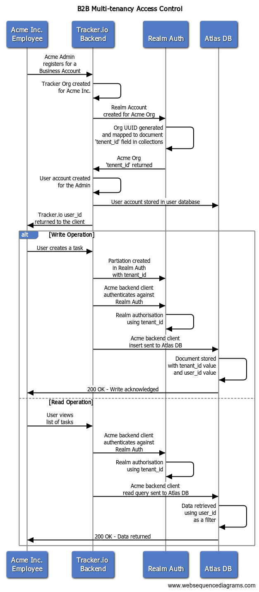
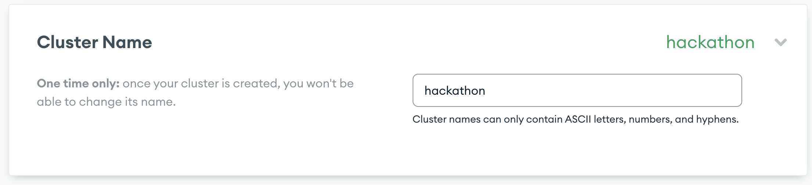

# Atlas Multi-tenancy with Realm Authentication and Authorisation

## Description
This proof illustrates how to implement a B2B multi-tenant cluster where customer data is logically separated at the document level and access to that data is controlled natively by Realm Authentication.

### The Problem to be Solved
Customers often ask us how they should store their B2B customer data in Atlas and how they should control the access to that data. Quite often we advise them that they should do the logcial seperation at the document level with the use of a tenant_id field in the documents. 

Often, the problem for customers is that they want to mange access control to the data from Atlas but to do this we would need to do the logical seperation at the collection or database level. However, because Atlas DBs only support 100 users, this would not scalable. So we often advise them that to take this document level multi-tenancy approach, they would need to manage data access control from their backend with code logic.

So a novel way to solve this requirement where Atlas manages the customer access control to data at the document level is to leverage Realm Authentication which natively allows you to not only create users and authenticate them but also utilise the tenant_ids in the documents to enable the authorisation at the document level.

### High Level Architecture



## Preparation

To help prove this solution we built a Tasktracker app to show how multi-tenancy can be achieved in a SaaS product using a single MongoDB Atlas application as a backend. The app allows business users to manage daily tasks that can be shared with multiple other users across a team or organization keeping permissions seperated.

Sample link can be found [here](https://tasktracker-clyob.mongodbstitch.com/). 


# Setup Prerequisites

## 1. Install `mongodb-realm-cli`

You can import the ready-made MongoDB Realm backend using the
`mongodb-realm-cli`, which you can install with npm:

```bash
npm install -g mongodb-realm-cli
```

## 2. Create an Atlas cluster with MongoDB 4.4+

To have a backend for your Task Tracker app, you will need a MongoDB Atlas
cluster with MongoDB 4.4 or higher. To create an Atlas account, project, and cluster, visit the [Atlas
UI](https://cloud.mongodb.com/?tck=docs_realm).

> ⚠️ Sync requires MongoDB 4.4 or above. Be sure to select at least MongoDB
> version 4.4 when building your cluster!

Log the name of your cluster as you will need it for a future step.  Example was created using "hackathon" as shown below.



## 3. Create an API Key and authenticate the CLI

To authenticate with the `realm-cli`, you must create an API key with **Project
Owner** permissions for your project in the **Project Access Manager** view.
Click the **Access Manager** at the top of the Atlas view to find it. Please
follow the [instructions on the MongoDB documentation
site](https://www.mongodb.com/docs/realm/deploy/realm-cli-reference/#authenticate-a-cli-user)
for more information.

Once created, pass the API keys to `realm-cli login` to log in:

```bash
realm-cli login --api-key=[PUBLIC API KEY] --private-api-key=[PRIVATE API KEY]
```

# Steps to Deploy Realm App

## 1. Clone Repository

Clone the repository 

```bash
git clone https://github.com/Ayaz20009/group-7-hackathon-backend.git
cd realm-tutorial-backend
```

## 2. Update Config File

Update the `data_sources/mongodb-atlas/config.json` file with your MongoDB Atlas cluster information.  

```bash
vim data_sources/mongodb-atlas/config.json
```
Example File: 

```json
{
    "name": "mongodb-atlas",
    "type": "mongodb-atlas",
    "config": {
        "clusterName": "[YOUR CLUSTER NAME]",
        "readPreference": "primary",
        "wireProtocolEnabled": false
    },
    "version": 1
}
```

## 3. Import the Realm backend app

If logged in successfully, you can now import the app:

```bash
realm-cli push
```

Follow the prompts and wait for the app to deploy.

Congratulations! You now have a working MongoDB Realm backend with Sync enabled.

## Issues & Pull Requests

If you find an issue or have a suggestion, please let us know using the feedback
widget on the [docs site](http://www.mongodb.com/docs/realm/tutorial).

This repo is automatically derived from our main docs repo. If you'd like to
submit a pull request -- thanks! -- please feel free to do so at
https://github.com/mongodb/docs-realm/ (see the tutorial/ subdirectory).


## Execution

## Conclusion
